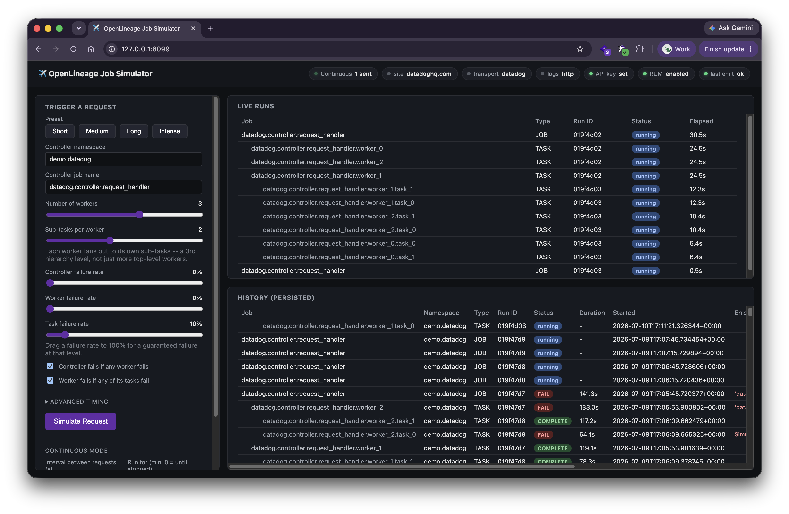
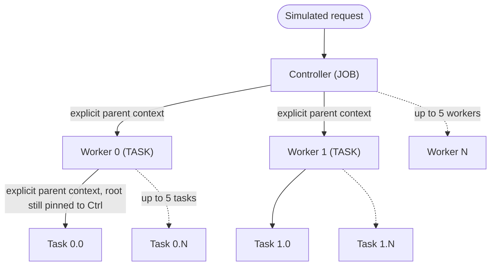

# OpenLineage Job Simulator

<p align="center">
  
  <br>
  <sub>Live controller → workers → sub-tasks fan-out, status pills, and persisted run history.</sub>
</p>

A self-contained demo app showing how to bolt Datadog **Jobs Monitoring
(Custom Jobs / OpenLineage)**, **APM (ddtrace)**, and **Log Management** onto
a **request-based worker fan-out** workflow — not a DAG/scheduler.

A controller receives a simulated request, dispatches 1–5 workers, and each
worker can dispatch its own sub-tasks (3 levels deep). Context is passed
explicitly at every level (namespace/name/runId, like a real container/queue
payload) — there's no implicit propagation, which is the point: request-based
workers must forward job identity themselves, the same way you'd forward a
trace context. Every run gets its own ddtrace span and structured JSON logs,
so a single failed run lets you pivot **Jobs Monitoring → APM trace → log
line**, all sharing the same identifiers.

## How it fans out



## Quick start

Or, with `make`: `make setup` (creates `.venv`, installs deps, copies
`.env.example` -> `.env` — remember to set `DD_API_KEY`), then `make run`
(or `make run-plain` to skip `ddtrace-run`). `make stop` kills a leftover
background instance. Run `make` with no target to list all of them.

With [`uv`](https://docs.astral.sh/uv/) (recommended):

```bash
uv venv
uv pip install -r requirements.txt
cp .env.example .env   # set DD_API_KEY -- the only required var
uv run --env-file .env -- ddtrace-run python app.py
```

With plain `pip`:

```bash
python3 -m venv .venv && source .venv/bin/activate
pip install -r requirements.txt
cp .env.example .env   # set DD_API_KEY -- the only required var
dotenv run -- ddtrace-run python app.py
```

Then open http://localhost:8080. Stop with Ctrl+C, or run
`./scripts/stop.sh` if a background instance got left running (auto-port
selection means a leftover process won't fail loudly — it just bumps the
next launch to the next port instead).

`ddtrace-run` gives automatic trace-ID injection into logs; `python app.py`
directly still works but loses that correlation. The `--env-file`/
`dotenv run --` wrapper matters because it loads `.env` _before_
`ddtrace-run`'s own bootstrap runs — anything ddtrace reads from the
environment at startup (like `DD_TRACE_AGENT_URL`) won't see a plain
in-app `load_dotenv()` in time otherwise.

## What it does

- **Trigger panel**: worker/task counts, per-level duration and failure-rate
  sliders, and cascade toggles (controller fails if a worker fails, worker
  fails if a task fails). Drag a failure rate to 100% for a guaranteed
  failure at that level.
- **Continuous mode**: repeats "Simulate Request" on an interval (with an
  optional run-for duration, or until you hit Stop) using whatever the
  trigger panel is currently set to — for sustained traffic instead of one
  click at a time. Runs server-side, so it keeps going even if you close
  the tab.
- **Live run view**: polls status every ~700ms until the request resolves.
- **History**: persisted to SQLite (`demo.db`), survives a restart, nested
  by hierarchy.
- **Status banner**: active site/transport/log-ship mode and the pass/fail
  outcome of the last OpenLineage emission — errors surface here, not
  swallowed.

## Configuration

Environment variables (or `.env`, loaded via `python-dotenv`). Only
`DD_API_KEY` is required — see `.env.example`.

| Variable                | Default                   | Purpose                                              |
| ----------------------- | ------------------------- | ---------------------------------------------------- |
| `DD_API_KEY`            | _(required)_              | Datadog API key                                      |
| `DD_SITE`               | `datadoghq.com`           | Datadog site                                         |
| `OL_TRANSPORT`          | `datadog`                 | `datadog` or `http`                                  |
| `OL_NAMESPACE`          | `demo.datadog`            | Default OpenLineage namespace                        |
| `OL_PRODUCER`           | placeholder GitHub URL    | `producer` field on events                           |
| `DD_SERVICE`            | `openlineage-worker-demo` | Base ddtrace/log service name                        |
| `DD_ENV`                | `demo`                    | `env` tag across traces/logs/OL tags                 |
| `DD_LOGS_INJECTION`     | `true`                    | ddtrace trace-ID injection into logs                 |
| `LOG_SHIP_MODE`         | `agent`                   | `agent` or `http` (see below)                        |
| `APP_PORT`              | `8080`                    | Local web UI port                                    |
| `DD_TRACE_AGENT_URL`    | _(optional)_              | Override APM endpoint, e.g. `http://127.0.0.1:8136`  |
| `DD_RUM_APPLICATION_ID` | _(optional)_              | RUM app ID — UI only inits RUM if set with the token |
| `DD_RUM_CLIENT_TOKEN`   | _(optional)_              | RUM client token                                     |

**`DD_TRACE_AGENT_URL`**: use `127.0.0.1`, not `localhost` — on most
systems `localhost` resolves IPv6 first, and an Agent bound only to IPv4
will hard-refuse that attempt (ddtrace won't retry as IPv4 the way
curl/browsers do, so the trace just silently drops).

**Transport (`OL_TRANSPORT`)**: `datadog` uses
`DatadogTransport`/`DatadogConfig` (requires `openlineage-python>=1.37.0`);
`http` is a generic OpenLineage HTTP fallback pointed at the same per-site
intake. Both fail fast if `DD_API_KEY` is missing.

**Logs (`LOG_SHIP_MODE`)**:

- `agent` — logs go to stdout only. This ships nowhere by itself; you need
  the Agent separately configured to tail this exact process (it doesn't
  auto-discover a bare local script's stdout the way it would a container).
- `http` (**recommended** unless you already have Agent log collection set
  up) — submits each line directly via the official `datadog-api-client`
  (`LogsApi.submit_log`), authenticated the same way as everything else.

Either mode tags every log line, trace span, and OpenLineage run with
matching `service`/`env`/`run_id` as a correlation fallback.

**RUM (optional)**: set `DD_RUM_APPLICATION_ID` + `DD_RUM_CLIENT_TOKEN`
(create one under **Digital Experience > RUM Applications**, browser/JS
type) to load the Browser SDK on the trigger page. Leave either blank and
the UI just skips it.

## Architecture

```
app/
  config.py             env-driven configuration
  openlineage_client.py OpenLineage client + transport + facet construction
  job_simulator.py      controller/worker/task fan-out, ddtrace spans, logs
  logging_setup.py      structured JSON logging, trace injection, shipping
  models.py             SQLite persistence for run history
  web.py                Flask app: UI + JSON API
  templates/index.html  single-page UI (vanilla JS, polling)
app.py                  entry point (run with `ddtrace-run python app.py`)
scripts/stop.sh         find & kill any leftover running instance
Makefile                setup/run/stop shortcuts (run `make` to list)
```

Each level runs on a `ThreadPoolExecutor`, not a task queue, so multiple
simulated requests run concurrently without blocking the UI.

## Demo script (failure → APM → logs pivot)

1. Drag a failure rate slider to 100% and click **Simulate Request**.
2. In **Jobs Monitoring**, open the `FAIL`'d run's `errorMessage` facet
   (message + real Python stack trace).
3. Pivot to the **APM trace** via the `_dd.ol_service` tag / matching
   service name + `run_id` tag.
4. From the trace, pivot to the **log line** for that failure — same
   `dd.trace_id`/`dd.span_id`, plus matching `run_id`/`service`/`env`.

## Notes

- Inputs/outputs are fake dataset descriptors (`postgres://demo-db.example.com:5432/orders.public.orders`
  → `snowflake://demo-org-demo-account/ANALYTICS.PUBLIC.ORDERS`) purely to
  render a lineage graph edge — no real data is touched.
- No periodic `RUNNING` heartbeats: a controller is implicitly "in
  progress" for as long as its terminal event hasn't landed, which falls
  out naturally from it blocking on its children.
- `root` in every `parent` facet stays pinned to the top-level controller
  at any depth, and the same holds for the ddtrace trace — controller,
  workers, and tasks land as one distributed trace, not several.
