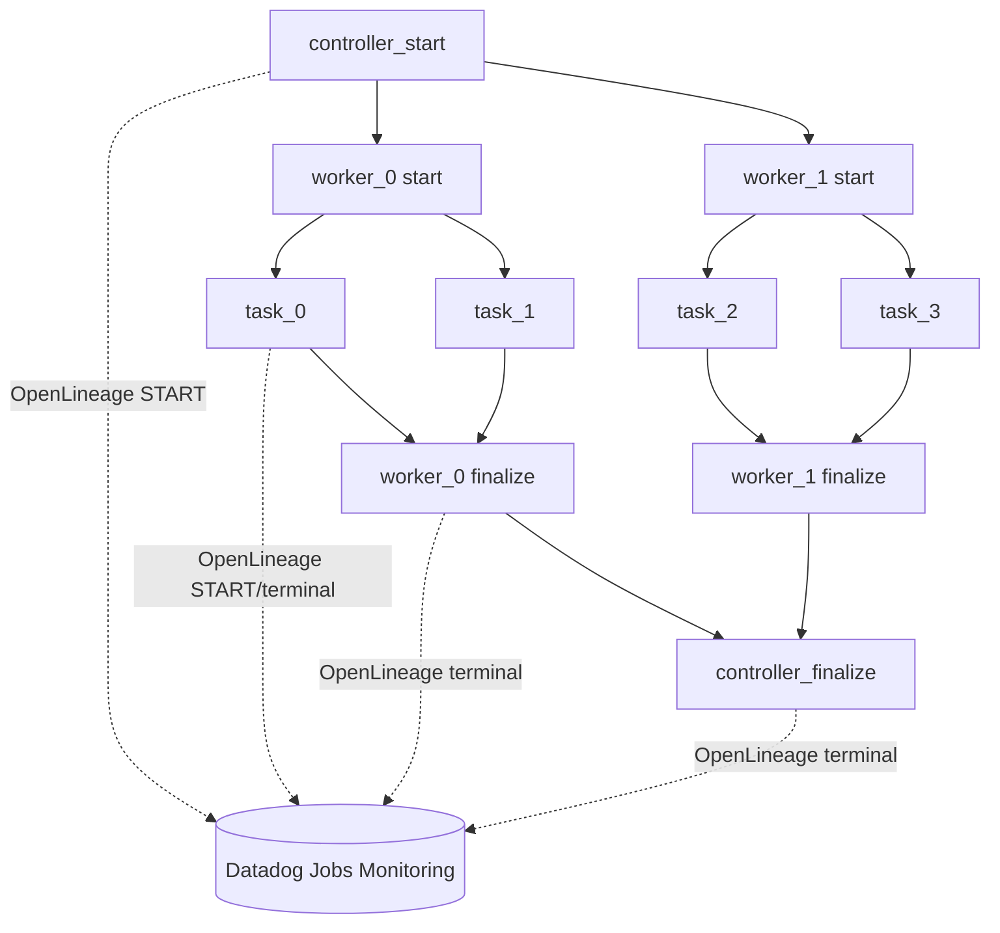

# OpenLineage Job Simulator on Azure ML

A demo job pipeline that fans a controller out to N workers, each of which fans out to M tasks, running as real Azure Machine Learning pipeline jobs — every node is its own Azure ML job with a native parent/child relationship in Studio's job graph — while emitting OpenLineage events and correlated logs to Datadog Jobs Monitoring.

**Scope: OpenLineage + Logs only.** APM distributed tracing (ddtrace spans connected across separate Azure ML job containers) is not implemented here — it's a follow-up phase. No ddtrace spans are opened by any script in this directory; `dd.trace_id`/`dd.span_id` log fields simply won't appear on logs from this path (that's expected, not a bug).

## How it works

- Azure ML's default job compute (`AmlCompute`) has no persistent host OS access, so there's no host-level Datadog Agent in this pipeline. Everything is library calls inside each job container: the OpenLineage Python client for job events, and direct-to-API log shipping (`LOG_SHIP_MODE=http`) for logs, since there's no local Agent to tail stdout.
- Azure ML pipeline DAGs are assembled in Python before submission, so the full worker/task counts and every OpenLineage `run_id` are decided up front by `azureml/plan.py` before the pipeline is built.
- Controller and worker nodes each run as two Azure ML steps: `*_start` emits the OpenLineage START event and sleeps to simulate its own duration, then exits; `*_finalize` runs once all of that node's children have completed, aggregates their pass/fail status, rolls its own random failure rate, and emits the terminal OpenLineage event. Tasks are single-step leaf nodes: start, simulated work, and terminal event all in one script.
- Azure ML's own job history (`az ml job list`, Studio's job graph) is the system of record for run status in this pipeline; Datadog is the system of record for job-run semantics via OpenLineage.



## Layout

```
azureml/
  plan.py               RequestPlan: decides fan-out shape + pre-generates every run_id
  submit_pipeline.py    Builds the pipeline DAG (SDK v2) and submits it
  cli.py                Standalone trigger: python -m azureml.cli --num-workers 2 --num-tasks 2
  steps/
    common.py            Shared OpenLineage emission calls + failure-decision math + status-file I/O
    run_node_start.py    controller_start / worker_start entrypoint
    run_node_finalize.py controller_finalize / worker_finalize entrypoint
    task_entrypoint.py   leaf task entrypoint
  environment/Dockerfile
  requirements-azureml.txt
```

`app/openlineage_client.py`, `app/logging_setup.py`, and `app/config.py` are reused as a library. `job_facets`/`emit_start`/`emit_terminal` accept an optional `aml_job_name` kwarg, and `logging_setup.py` stamps `azureml.job_name` on every log line (from the `AZUREML_RUN_ID` env var Azure ML injects automatically) — this lets you pivot from a Datadog OpenLineage run or log line to the exact Azure ML Studio job page.

## One-time setup

### 1. Workspace + compute cluster

```bash
az extension add -n ml
az ml workspace create -g <resource-group> -n <workspace-name>

az ml compute create --type AmlCompute --name sim-cluster --min-instances 0 --max-instances 4 -g <resource-group> -w <workspace-name>
```

### 2. Register the custom environment

Build context is the repo root (so both `app/` and `azureml/` are included):

```bash
cd /path/to/openlineage-job-simulator
az ml environment create --name openlineage-job-simulator --build-context . --dockerfile-path azureml/environment/Dockerfile -g <resource-group> -w <workspace-name>
```

### 3. Store DD_API_KEY in Key Vault (never in a checked-in file)

```bash
az keyvault secret set --vault-name <your-keyvault> --name DD-API-KEY --value <your-datadog-api-key>
```

Every Azure ML workspace has an associated Key Vault (`az ml workspace show` lists it under `key_vault`), or use your own. `submit_pipeline.py` resolves this secret at submission time under your own Azure credentials (`DefaultAzureCredential`) and injects it into each step's `environment_variables` — it's never written to a component spec, the Dockerfile, or git, mirroring how the Flask app keeps it out of git via `.env`.

### 4. Environment variables for the driver

```bash
export AZUREML_SIM_SUBSCRIPTION_ID=<subscription-id>
export AZUREML_SIM_RESOURCE_GROUP=<resource-group>
export AZUREML_SIM_WORKSPACE=<workspace-name>
export AZUREML_SIM_COMPUTE=sim-cluster                 # optional, defaults shown
export AZUREML_SIM_ENVIRONMENT=azureml:openlineage-job-simulator@latest  # optional
export AZUREML_SIM_KEYVAULT_URL=https://<your-keyvault>.vault.azure.net/
export AZUREML_SIM_DD_API_KEY_SECRET=DD-API-KEY        # optional, this is the default

# Same knobs as .env.example (all optional, shown with defaults):
export DD_SITE=datadoghq.com
export DD_SERVICE=openlineage-worker-demo
export DD_ENV=azureml-demo
export OL_TRANSPORT=datadog
export OL_NAMESPACE=demo.datadog.azureml
```

Install the driver-side dependencies and authenticate:

```bash
pip install -r requirements-azureml.txt
az login
```

## Submitting a run

```bash
python -m azureml.cli --num-workers 2 --num-tasks 2
```

Prints the Azure ML pipeline job name and the controller's OpenLineage `run_id`. Pass `--task-failure-rate 100` (default `fail_worker_on_task_fail` is `True`) to exercise the FAIL/cascade path end-to-end. See `cli.py --help` for the full set of flags (durations, failure rates, force-fail switches per level).

## Verifying it worked

1. **Azure ML Studio** — open the pipeline job. The graph should show one `controller_start`/`controller_finalize` pair, one `*_start`/`*_finalize` pair per worker, and one leaf step per task. `az ml job show -n <job-name>` confirms overall status.
2. **Datadog Jobs Monitoring** — search the controller's `run_id` printed by `cli.py`; the controller → worker → task hierarchy should render via the `parent`/`root` OpenLineage facets.
3. **Datadog Logs** — search `@openlineage.run_id:<runId>` for any specific step's run_id; matching log lines should carry `azureml.job_name`, letting you jump to that step's exact Studio job page.
4. **Failure path** — resubmit with `--task-failure-rate 100`; confirm the `worker*_finalize` steps read the aggregated task statuses correctly and emit `FAIL` with the `error_facet` traceback, and that it propagates to `controller_finalize` (pass `--no-fail-controller-on-worker-fail` to disable the cascade).

## Deferred: APM distributed tracing

Connecting real ddtrace spans across separate pipeline step containers needs distributed trace-context propagation (`ddtrace.Context(trace_id=..., span_id=...)` reconstructed from ids passed as step parameters, the same pattern ddtrace uses for HTTP headers) and resolving whether ddtrace needs a reachable Datadog Agent (none exists on `AmlCompute`) or can run in agentless/HTTP-intake mode. Smoke-test that in a minimal 2-step pipeline before building it out — it's the highest-risk piece of that follow-up phase, not part of this one.
