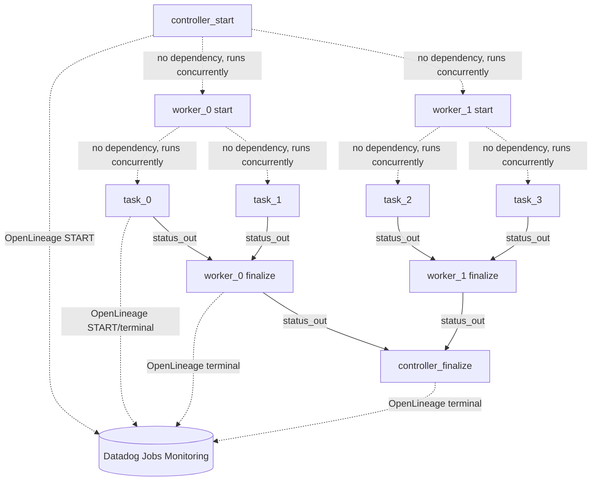
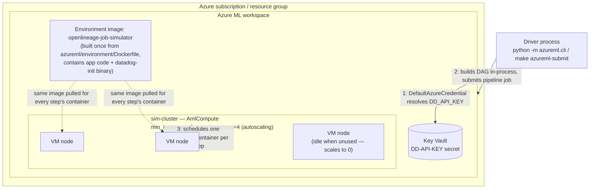

# OpenLineage Job Simulator on Azure ML

A demo job pipeline that fans a controller out to N workers, each of which fans out to M tasks, running as real Azure Machine Learning pipeline jobs — every node is its own Azure ML job with a native parent/child relationship in Studio's job graph — while emitting OpenLineage events and correlated logs to Datadog Jobs Monitoring.

**Scope: OpenLineage + Logs + single-container APM spans.** Each step opens one ddtrace span for its own work (`azureml/steps/common.py`'s `traced_step()`), tagged with its OpenLineage `run_id`/job name for cross-referencing a trace to its run in Data Jobs Monitoring. What's still a follow-up phase is *distributed* tracing — linking those per-container spans into one trace across the controller/worker/task hierarchy, which needs explicit trace-context propagation (see "Deferred: APM distributed tracing" below). Each step's container runs Datadog's `serverless-init` as an experimental add-on (see below) to actually forward those spans — that forwarding path is unverified until smoke-tested against a real run.

## How it works

- Azure ML's default job compute (`AmlCompute`) has no persistent host OS access, so there's no host-level Datadog Agent in this pipeline. Everything is library calls inside each job container: the OpenLineage Python client for job events, and direct-to-API log shipping (`LOG_SHIP_MODE=http`) for logs, since there's no local Agent to tail stdout.
- Azure ML pipeline DAGs are assembled in Python before submission, so the full worker/task counts and every OpenLineage `run_id` are decided up front by `azureml/plan.py` before the pipeline is built.
- Controller and worker nodes each run as two Azure ML steps: `*_start` emits the OpenLineage START event and sleeps to simulate its own duration, then exits; `*_finalize` runs once all of that node's children have completed, aggregates their pass/fail status, rolls its own random failure rate, and emits the terminal OpenLineage event. Tasks are single-step leaf nodes: start, simulated work, and terminal event all in one script.
- Azure ML's own job history (`az ml job list`, Studio's job graph) is the system of record for run status in this pipeline; Datadog is the system of record for job-run semantics via OpenLineage.

**Execution order is not enforced except where a real data dependency exists.** Azure ML only sequences steps that consume each other's outputs. `task` → `*_finalize` is a real dependency (`task_step.outputs.status_out` feeds a `child_N` input), so Azure ML waits for all tasks before running a worker's finalize step, and Studio's Designer view draws that edge. `controller_start` → `worker_start` and `worker_start` → `task` are **not** real dependencies — those steps only receive literal values decided up front by `azureml/plan.py` (namespace, names, pre-generated run_ids), not another step's output — so Azure ML is free to run them concurrently, and Studio's Designer view shows `*_start` steps as disconnected boxes with no incoming/outgoing edges. This is expected, not a bug: a worker's OpenLineage START event can land in Datadog before or during the controller's, unlike the original Flask app's strictly sequential fan-out. The OpenLineage `parent`/`root` facets still correctly represent the logical hierarchy in Datadog regardless of actual execution order.



## Layout

```
azureml/
  plan.py               RequestPlan: decides fan-out shape + pre-generates every run_id
  submit_pipeline.py    Builds the pipeline DAG (SDK v2) and submits it
  cli.py                Standalone trigger: python -m azureml.cli --num-workers 2 --num-tasks 2
  steps/
    common.py            Shared OpenLineage emission calls + failure-decision math + status-file I/O
    run_node_start.py    controller_start / worker_start entrypoint
    run_node_finalize.py controller_finalize / worker_finalize entrypoint
    task_entrypoint.py   leaf task entrypoint
  environment/Dockerfile
  requirements-azureml.txt
```

`app/openlineage_client.py`, `app/logging_setup.py`, and `app/config.py` are reused as a library. `job_facets`/`emit_start`/`emit_terminal` accept an optional `aml_job_name` kwarg, and `logging_setup.py` stamps `azureml.job_name` on every log line (from the `AZUREML_RUN_ID` env var Azure ML injects automatically) — this lets you pivot from a Datadog OpenLineage run or log line to the exact Azure ML Studio job page.

## Compute architecture

Everything below is provisioned once (see "One-time setup") and then reused by every pipeline run. There's one compute cluster and one environment image for the whole demo — a run's fan-out shape only changes how many containers get scheduled onto that cluster, not what's provisioned.



Points worth calling out:

- **One cluster, many containers.** `sim-cluster` is a shared, autoscaling `AmlCompute` pool (`az ml compute create ... --min-instances 0 --max-instances 4`). Azure ML — not this codebase — decides which VM node each step's container lands on; `submit_pipeline.py` never targets a specific node.
- **One image, many containers.** Every step (`controller_start`, `worker_*_start/finalize`, `task_*`) runs the *same* `openlineage-job-simulator` environment image, registered once via `az ml environment create`. What differs per step is only the `command:` string and `inputs`/`environment_variables` `submit_pipeline.py` passes in — not the image.
- **Container lifetime = step lifetime.** Each step gets a fresh container that starts, runs its one command (e.g. `python -m azureml.steps.run_node_start ...`), and exits — there's no long-lived container reused across steps, and no host-level process (like a Datadog Agent) surviving between them.
- **Secret resolution happens on the driver, not in a container.** `DD_API_KEY` is pulled from Key Vault by the submitting process under your own `az login` identity and injected into each step's `environment_variables` at submission time — no container ever talks to Key Vault itself.

## One-time setup

### 1. Workspace + compute cluster

```bash
az extension add -n ml
az ml workspace create -g <resource-group> -n <workspace-name>

az ml compute create --type AmlCompute --name sim-cluster --min-instances 0 --max-instances 4 -g <resource-group> -w <workspace-name>
```

### 2. Register the custom environment

Build context is the repo root (so both `app/` and `azureml/` are included):

```bash
cd /path/to/openlineage-job-simulator
az ml environment create --name openlineage-job-simulator --build-context . --dockerfile-path azureml/environment/Dockerfile -g <resource-group> -w <workspace-name>
```

### 3. Store DD_API_KEY in Key Vault (never in a checked-in file)

```bash
az keyvault secret set --vault-name <your-keyvault> --name DD-API-KEY --value <your-datadog-api-key>
```

Every Azure ML workspace has an associated Key Vault (`az ml workspace show` lists it under `key_vault`), or use your own. `submit_pipeline.py` resolves this secret at submission time under your own Azure credentials (`DefaultAzureCredential`) and injects it into each step's `environment_variables` — it's never written to a component spec, the Dockerfile, or git, mirroring how the Flask app keeps it out of git via `.env`.

### 4. Environment variables for the driver

Copy `azureml/.env.example` to `azureml/.env` and fill it in (it's gitignored, same pattern as the root `.env`):

```bash
cp azureml/.env.example azureml/.env
```

At minimum, set `AZUREML_SIM_SUBSCRIPTION_ID`, `AZUREML_SIM_RESOURCE_GROUP`, `AZUREML_SIM_WORKSPACE`, and either `AZUREML_SIM_KEYVAULT_URL` (recommended — resolves `DD_API_KEY` from Key Vault at submission time) or `DD_API_KEY` directly (fallback for local iteration, skips step 3 above). `azureml/cli.py` loads this file automatically.

Install the driver-side dependencies and authenticate:

```bash
pip install -r requirements-azureml.txt
az login
```

## Submitting a run

```bash
python -m azureml.cli --num-workers 2 --num-tasks 2
```

Prints the Azure ML pipeline job name and the controller's OpenLineage `run_id`. Pass `--task-failure-rate 100` (default `fail_worker_on_task_fail` is `True`) to exercise the FAIL/cascade path end-to-end. See `cli.py --help` for the full set of flags (durations, failure rates, force-fail switches per level).

## Using the Studio portal (ml.azure.com)

There's no "submit a new job" button for this pipeline in Studio, since `submit_pipeline.py` builds the entire DAG dynamically in Python at submission time — worker/task counts vary per request, which changes each `*_finalize` step's input signature. Studio's native job-creation UI only works against pre-registered, fixed-signature pipeline/component assets, which this isn't. Triggering always goes through `python -m azureml.cli`.

Once a job has been submitted at least once, the portal is useful for:

- **Jobs → your pipeline job** — the live DAG, per-step status, logs, and duration.
- **Resubmit** — reruns a completed/failed job with the same parameters and topology as a new run.
- **Cancel** a running job, or download a specific step's logs.

## Verifying it worked

1. **Azure ML Studio** — open the pipeline job. The graph should show one `controller_start`/`controller_finalize` pair, one `*_start`/`*_finalize` pair per worker, and one leaf step per task. `az ml job show -n <job-name>` confirms overall status.
2. **Datadog Jobs Monitoring** — search the controller's `run_id` printed by `cli.py`; the controller → worker → task hierarchy should render via the `parent`/`root` OpenLineage facets.
3. **Datadog Logs** — search `@openlineage.run_id:<runId>` for any specific step's run_id; matching log lines should carry `azureml.job_name`, letting you jump to that step's exact Studio job page.
4. **Failure path** — resubmit with `--task-failure-rate 100`; confirm the `worker*_finalize` steps read the aggregated task statuses correctly and emit `FAIL` with the `error_facet` traceback, and that it propagates to `controller_finalize` (pass `--no-fail-controller-on-worker-fail` to disable the cascade).

## Experimental: Datadog serverless-init

Every step's container runs [`datadog-init`](https://docs.datadoghq.com/serverless/azure_container_apps/) as a process wrapper — the Dockerfile copies the binary in from `datadog/serverless-init:1`, and `submit_pipeline.py` prefixes each step's command with it (e.g. `/app/datadog-init python -m azureml.steps.run_node_start ...`), controlled by `AZUREML_SIM_USE_SERVERLESS_INIT` (defaults to `true`; set to `false` to disable and fall back to plain library calls).

**This is not documented or supported by Datadog for Azure ML** — only Container Apps and App Service Linux containers are. It's wired in as a command prefix rather than a Dockerfile `ENTRYPOINT` because Azure ML likely execs a step's `command:` directly, and may not honor an image's own `ENTRYPOINT`. Conceptually it should fit reasonably well — `datadog-init` is built for short-lived, invocation-style processes that start, do work, flush telemetry, and exit, which is close to a batch job step's lifecycle — but treat its behavior (env var propagation, flush-on-exit timing, whether it survives a job timeout/kill) as unverified until smoke-tested against a real run.

Because `datadog-init` captures and forwards each step's stdout itself, `LOG_SHIP_MODE` is automatically set to `agent` (stdout only) instead of `http` when serverless-init is enabled, to avoid shipping the same logs twice.

### Why this isn't a sidecar container

`datadog-init` runs *inside* each step's single container as a wrapped process (`/app/datadog-init ddtrace-run python -m azureml.steps...`), not as a second container next to it — because Azure ML's `command` job doesn't have a slot for one. The [CLI v2 command-job YAML schema](https://learn.microsoft.com/en-us/azure/machine-learning/reference-yaml-job-command?view=azureml-api-2) takes exactly one `environment` (one image) per job/step, on both `AmlCompute` and Kubernetes compute; there's no `containers:` list or sidecar field to declare a second one. (True multi-container "sidecar" support in Azure ML is a managed-online-endpoint concept — real-time model serving deployments — and doesn't extend to batch/pipeline command jobs like these.)

So the only way to run something alongside a step's main process is what's done here: bake it into the same environment image (`environment/Dockerfile` copies in the `datadog-init` binary) and launch it as the top-level process that then execs your real command. If you needed a *different* always-on companion process per step, the same pattern applies — add it to the Dockerfile and prefix/background it in the step's `command:` string in `submit_pipeline.py`; there's no separate container to configure.

## Deferred: APM distributed tracing

Each step already opens its own span (`common.traced_step()`) — what's still deferred is connecting those spans *across* separate pipeline step containers into one distributed trace. That needs explicit trace-context propagation (`ddtrace.Context(trace_id=..., span_id=...)` reconstructed from ids passed as step parameters, the same pattern ddtrace uses for HTTP headers) and resolving whether ddtrace needs a reachable Datadog Agent (none exists on `AmlCompute`) or can run in agentless/HTTP-intake mode. Smoke-test that in a minimal 2-step pipeline before building it out — it's the highest-risk piece of that follow-up phase, not part of this one.
